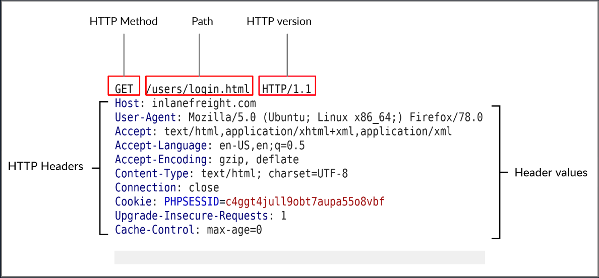
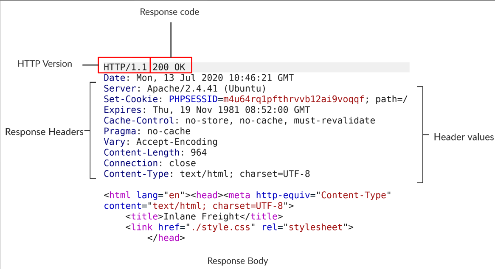
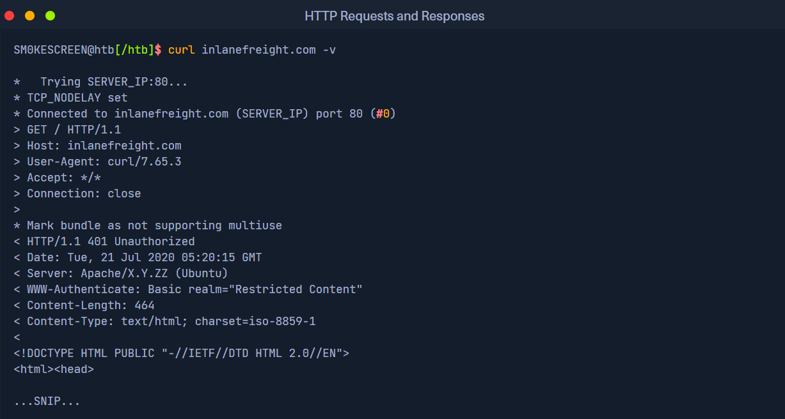
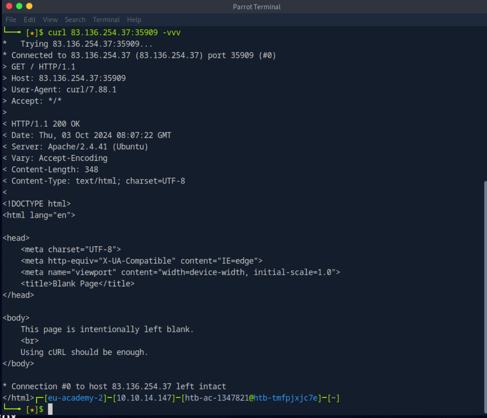

HTTP communications mainly consist of an HTTP request and an HTTP response. An HTTP request is made by the client (e.g. cURL/browser), and is processed by the server (e.g. web server). The requests contain all of the details we require from the server, including the resource (e.g. URL, path, parameters), any request data, headers or options we specify, and many other options we will discuss throughout this module.

Once the server receives the HTTP request, it processes it and responds by sending the HTTP response, which contains the response code, as discussed in a later section, and may contain the resource data if the requester has access to it.


The first line of any HTTP request contains three main fields 'separated by spaces':

|**Field**|**Example**|**Description**|
|---|---|---|
|`Method`|`GET`|The HTTP method or verb, which specifies the type of action to perform.|
|`Path`|`/users/login.html`|The path to the resource being accessed. This field can also be suffixed with a query string (e.g. `?username=user`).|
|`Version`|`HTTP/1.1`|The third and final field is used to denote the HTTP version.|

The next set of lines contain HTTP header value pairs, like `Host`, `User-Agent`, `Cookie`, and many other possible headers. These headers are used to specify various attributes of a request. The headers are terminated with a new line, which is necessary for the server to validate the request. Finally, a request may end with the request body and data.

## HTTP Response

Once the server processes our request, it sends its response. The following is an example HTTP response:



The first line of an HTTP response contains two fields separated by spaces. The first being the `HTTP version` (e.g. `HTTP/1.1`), and the second denotes the `HTTP response code` (e.g. `200 OK`).

Response codes are used to determine the request's status, as will be discussed in a later section. After the first line, the response lists its headers, similar to an HTTP request. Both request and response headers are discussed in the next section.

Finally, the response may end with a response body, which is separated by a new line after the headers. The response body is usually defined as `HTML` code. However, it can also respond with other code types such as `JSON`, website resources such as images, style sheets or scripts, or even a document such as a PDF document hosted on the webserver.

## cURL

In our earlier examples with cURL, we only specified the URL and got the response body in return. However, cURL also allows us to preview the full HTTP request and the full HTTP response, which can become very handy when performing web penetration tests or writing exploits. To view the full HTTP request and response, we can simply add the `-v` verbose flag to our earlier commands, and it should print both the request and response:
https://academy.hackthebox.com/module/35/section/220


Say less, -v for verbose
-vvv for more verbose

Questions:

*What is the HTTP method used while intercepting the request? (case-sensitive)*



Answers:

```
GET
```

*Send a GET request to the above server, and read the response headers to find the version of Apache running on the server, then submit it as the answer. (answer format: X.Y.ZZ)*

Answers:

```
2.4.41
```

I mean, it's already given in the screenshot so...


