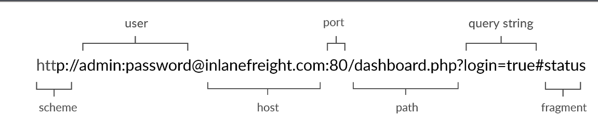
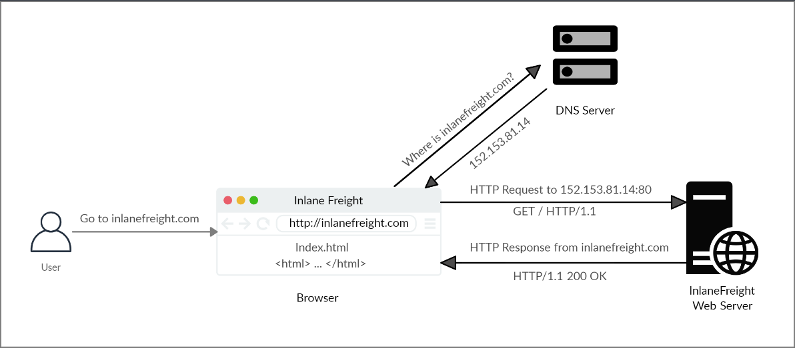
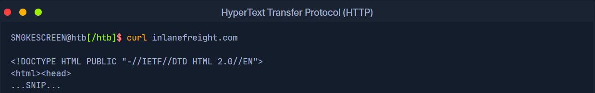
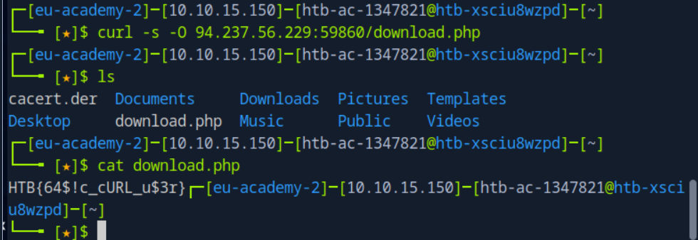

## URL

Resources over HTTP are accessed via a `URL`, which offers many more specifications than simply specifying a website we want to visit. Let's look at the structure of a URL:


| **Component**  | **Example**          | **Description**                                                                                                                                                                       |
| -------------- | -------------------- | ------------------------------------------------------------------------------------------------------------------------------------------------------------------------------------- |
| `Scheme`       | `http://` `https://` | This is used to identify the protocol being accessed by the client, and ends with a colon and a double slash (`://`)                                                                  |
| `User Info`    | `admin:password@`    | This is an optional component that contains the credentials (separated by a colon `:`) used to authenticate to the host, and is separated from the host with an at sign (`@`)         |
| `Host`         | `inlanefreight.com`  | The host signifies the resource location. This can be a hostname or an IP address                                                                                                     |
| `Port`         | `:80`                | The `Port` is separated from the `Host` by a colon (`:`). If no port is specified, `http` schemes default to port `80` and `https` default to port `443`                              |
| `Path`         | `/dashboard.php`     | This points to the resource being accessed, which can be a file or a folder. If there is no path specified, the server returns the default index (e.g. `index.html`).                 |
| `Query String` | `?login=true`        | The query string starts with a question mark (`?`), and consists of a parameter (e.g. `login`) and a value (e.g. `true`). Multiple parameters can be separated by an ampersand (`&`). |
| `Fragments`    | `#status`            | Fragments are processed by the browsers on the client-side to locate sections within the primary resource (e.g. a header or section on the page).                                     |



The first time a user enters the URL (`inlanefreight.com`) into the browser, it sends a request to a DNS (Domain Name Resolution) server to resolve the domain and get its IP. The DNS server looks up the IP address for `inlanefreight.com` and returns it. All domain names need to be resolved this way, as a server can't communicate without an IP address.

Once the browser gets the IP address linked to the requested domain, it sends a GET request to the default HTTP port (e.g. `80`), asking for the root `/` path. Then, the web server receives the request and processes it. By default, servers are configured to return an index file when a request for `/` is received.

In this case, the contents of `index.html` are read and returned by the web server as an HTTP response. The response also contains the status code (e.g. `200 OK`), which indicates that the request was successfully processed. The web browser then renders the `index.html` contents and presents it to the user.

## cURL

In this module, we will be sending web requests through two of the most important tools for any web penetration tester, a Web Browser, like Chrome or Firefox, and the `cURL` command line tool.

[cURL](https://curl.haxx.se/) (client URL) is a command-line tool and library that primarily supports HTTP along with many other protocols. This makes it a good candidate for scripts as well as automation, making it essential for sending various types of web requests from the command line, which is necessary for many types of web penetration tests.

We can send a basic HTTP request to any URL by using it as an argument for cURL, as follows:



Wanna figure out more about curl ? Look at the curl cheatsheet in the Cheatsheets folder !
Questions:

*To get the flag, start the above exercise, then use cURL to download the file returned by '/download.php' in the server shown above.*

Step 1: Open the bash (if you can't maybe you probably spawned the wrong instance or perhaps even the wrong OS)

Step 2: Do a curl command, can probably use -s -O to silent the status , here's a quick guide from curl -h as well as the command i did
 `curl -s -O 94.237.56.229:59860/download.php`
```shell-session
 -O, --remote-name   Write output to a file named as the remote file
 -s, --silent        Silent mode
```

Step 3: ls and cat, if you can't maybe you need an intro to linux, and bam you get the flag, welcome to HackTheBox where your pain has JUST started.



Here's the flag if you're lazy.

Answers:

```
HTB{64$!c_cURL_u$3r}
```
