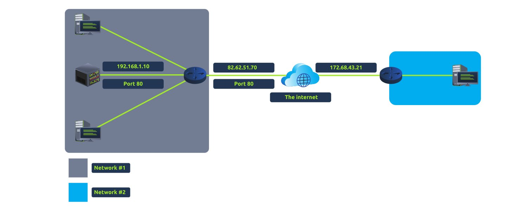
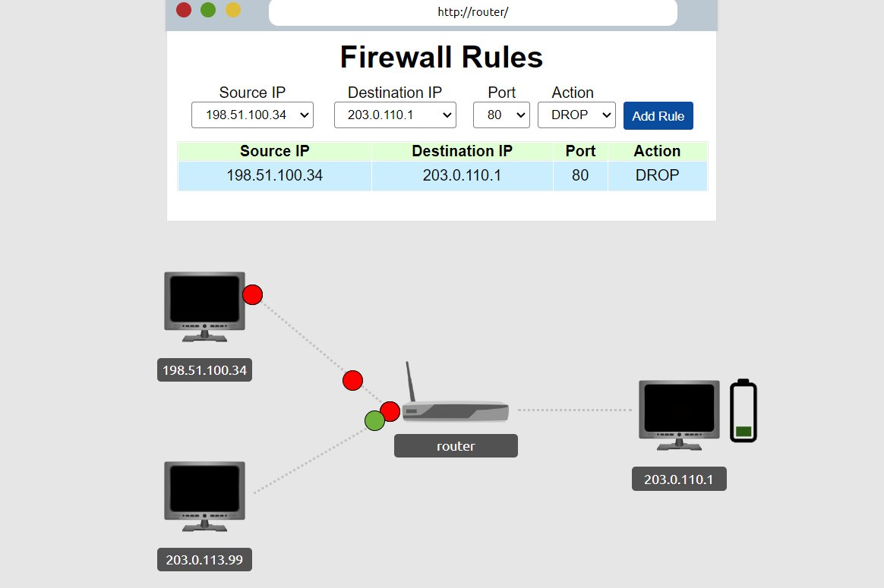
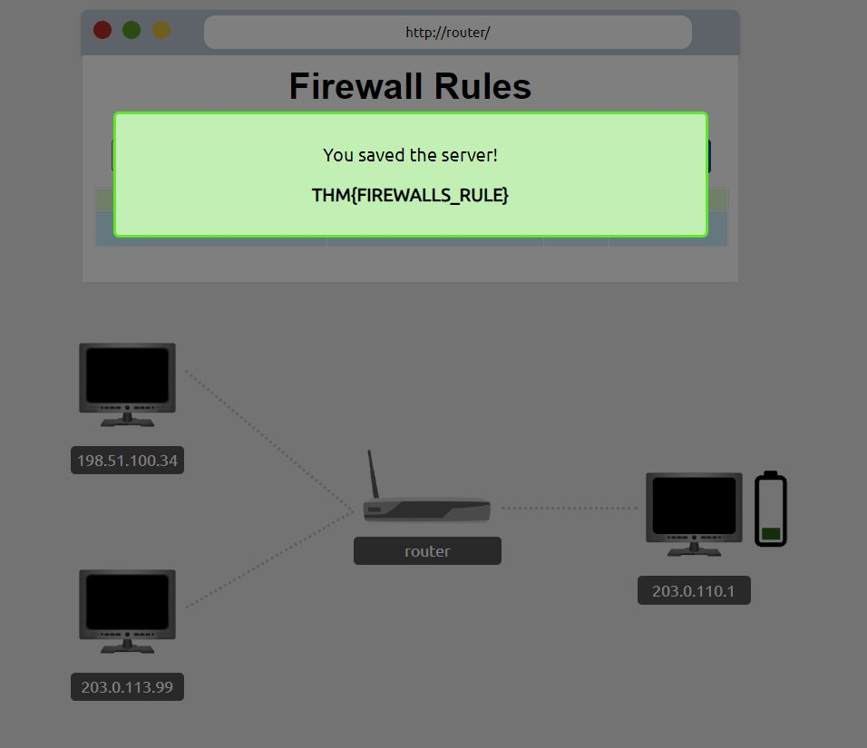

Task 1
Port forwarding is an essential component in connecting applications and services to the Internet. Without port forwarding, applications and services such as web servers are only available to devices within the same direct network.



Answers:

What is the name of the device that is used to configure port forwarding?
```
router
```

**Task 2**

A firewall is a device within a network responsible for determining what traffic is allowed to enter and exit. Think of a firewall as border security for a network. An administrator can configure a firewall to **permit** or **deny** traffic from entering or exiting a network based on numerous factors such as:

- Where the traffic is coming from? (has the firewall been told to accept/deny traffic from a specific network?)
- Where is the traffic going to? (has the firewall been told to accept/deny traffic destined for a specific network?)
- What port is the traffic for? (has the firewall been told to accept/deny traffic destined for port 80 only?)
- What protocol is the traffic using? (has the firewall been told to accept/deny traffic that is UDP, TCP or both?)

| **Firewall Category** | **Description**                                                                                                                                                                                                                                                                                                                                                                                                                                                                                                                                                                                                                                     |
| --------------------- | --------------------------------------------------------------------------------------------------------------------------------------------------------------------------------------------------------------------------------------------------------------------------------------------------------------------------------------------------------------------------------------------------------------------------------------------------------------------------------------------------------------------------------------------------------------------------------------------------------------------------------------------------- |
| Stateful              | This type of firewall uses the entire information from a connection; rather than inspecting an individual packet, this firewall determines the behaviour of a device **based upon the entire connection**.<br><br>This firewall type consumes many resources in comparison to stateless firewalls as the decision making is dynamic. For example, a firewall could allow the first parts of a TCP handshake that would later fail.<br><br>If a connection from a host is bad, it will block the entire device.                                                                                                                                      |
| Stateless             | This firewall type uses a static set of rules to determine whether or not **individual packets** are acceptable or not. For example, a device sending a bad packet will not necessarily mean that the entire device is then blocked.<br><br>Whilst these firewalls use much fewer resources than alternatives, they are much dumber. For example, these firewalls are only effective as the rules that are defined within them. If a rule is not exactly matched, it is effectively useless.<br><br>However, these firewalls are great when receiving large amounts of traffic from a set of hosts (such as a Distributed Denial-of-Service attack) |
Answers:

What layers of the OSI model do firewalls operate at?
```
Layer 3, Layer 4
```
What category of firewall inspects the **entire connection**?
```
stateful
```
What category of firewall inspects individual packets?
```
stateless
```

**Task 3**

Quick guide, as the instructions suggest, see the red balls ? yea they bad ... click the drop down select the IP, click port 80, and add the rule.


Honestly nothing much in this particular practical. So here's the flag if you're lazy:

Answers:
```
THM{FIREWALLS_RULE}
```

**Task 4**

A **V**irtual **P**rivate **N**etwork (or **VPN** for short) is a technology that allows devices on separate networks to communicate securely by creating a dedicated path between each other over the Internet (known as a tunnel). Devices connected within this tunnel form their own private network.

| **Benefit**                                                          | **Description**                                                                                                                                                                                                                                                                                                                                                                                                                                                               |
| -------------------------------------------------------------------- | ----------------------------------------------------------------------------------------------------------------------------------------------------------------------------------------------------------------------------------------------------------------------------------------------------------------------------------------------------------------------------------------------------------------------------------------------------------------------------- |
| Allows networks in different geographical locations to be connected. | For example, a business with multiple offices will find VPNs beneficial, as it means that resources like servers/infrastructure can be accessed from another office.                                                                                                                                                                                                                                                                                                          |
| Offers privacy.                                                      | VPN technology uses encryption to protect data. This means that it can only be understood between the devices it was being sent from and is destined for, meaning the data isn't vulnerable to sniffing.<br><br>This encryption is useful in places with public WiFi, where no encryption is provided by the network. You can use a VPN to protect your traffic from being viewed by other people.                                                                            |
| Offers anonymity.                                                    | Journalists and activists depend upon VPNs to safely report on global issues in countries where freedom of speech is controlled.<br><br>Usually, your traffic can be viewed by your ISP and other intermediaries and, therefore, tracked. <br><br>The level of anonymity a VPN provides is only as much as how other devices on the network respect privacy. For example, a VPN that logs all of your data/history is essentially the same as not using a VPN in this regard. |
| **VPN Technology**                                                   | **Description**                                                                                                                                                                                                                                                                                                                                                                                                                                                               |
| PPP                                                                  | This technology is used by PPTP (explained below) to allow for authentication and provide encryption of data. VPNs work by using a private key and public certificate (similar to **SSH**). A private key & certificate must match for you to connect.<br><br>This technology is not capable of leaving a network by itself (non-routable).                                                                                                                                   |
| PPTP                                                                 | The **P**oint-to-**P**oint **T**unneling **P**rotocol (**PPTP**) is the technology that allows the data from PPP to travel and leave a network. <br><br>PPTP is very easy to set up and is supported by most devices. It is, however, weakly encrypted in comparison to alternatives.                                                                                                                                                                                         |
| IPSec                                                                | Internet Protocol Security (IPsec) encrypts data using the existing **I**nternet **P**rotocol (**IP**) framework.<br><br>IPSec is difficult to set up in comparison to alternatives; however, if successful, it boasts strong encryption and is also supported on many devices.                                                                                                                                                                                               |
Answers:

What VPN technology **only** encrypts & provides the authentication of data?
```
PPP
```
What VPN technology uses the IP framework?
```
IPSec
```

**Task 5**
I'm pretty sure I had some notes on what is a router and what is a switch already so I won't go through it so here's the answers:

Answers:
What is the verb for the action that a router does?
```
routing
```
What are the two different layers of switches? Separate these by a comma I.e.: LayerX,LayerY
```
Layer2,Layer3
```

**Task 6**
I'm not even kidding, there's actually not much to do for this, you literally just click Send Packet and let it rip, anyways as usual here are the answers:


Answers:

What is the flag from the network simulator?
```
THM{YOU'VE_GOT_DATA}
```
How many HANDSHAKE entries are there in the Network Log?
```
5
```

And that's the end of the Network Fundamentals.
