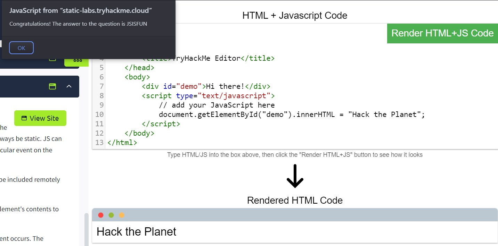

**Task 1**

There are two major components that make up a website:

1. Front End (Client-Side) - the way your browser renders a website.
2. Back End (Server-Side) - a server that processes your request and returns a response.

There are many other processes involved in your browser making a request to a web server, but for now, you just need to understand that you make a request to a server, and it responds with data your browser uses to render information to you.

What term best describes the component of a web application rendered by your browser?

```
Front End
```

**Task 2**

The HTML structure (as shown in the screenshot) has the following components:

- The `<!DOCTYPE html>` defines that the page is a HTML5 document. This helps with standardisation across different browsers and tells the browser to use HTML5 to interpret the page.
- The `<html>` element is the root element of the HTML page - all other elements come after this element.
- The `<head>` element contains information about the page (such as the page title)
- The `<body>` element defines the HTML document's body; only content inside of the body is shown in the browser.
- The `<h1>` element defines a large heading
- The `<p>` element defines a paragraph
- There are many other elements (tags) used for different purposes. For example, there are tags for buttons (`<button>`), images (``), lists, and much more.

Questions:

One of the images on the cat website is broken - fix it, and the image will reveal the hidden text answer!

basically missing a jpg, can just add .jpg to cat-2

Answers:

```
HTMLHERO
```

Add a dog image to the page by adding another img tag () on line 11. The dog image location is img/dog-1.png. What is the text in the dog image?


I mean just copy and paste the img src, nothing rocket science.

Answers:

```
DOGHTML
```

**Task 3**

JavaScript (JS) is one of the most popular coding languages in the world and allows pages to become interactive. HTML is used to create the website structure and content, while JavaScript is used to control the functionality of web pages - without JavaScript, a page would not have interactive elements and would always be static. JS can dynamically update the page in real-time, giving functionality to change the style of a button when a particular event on the page occurs (such as when a user clicks a button) or to display moving animations.

JavaScript is added within the page source code and can be either loaded within `<script>` tags or can be included remotely with the src attribute: `<script src="/location/of/javascript_file.js"></script>`

The following JavaScript code finds a HTML element on the page with the id of "demo" and changes the element's contents to "Hack the Planet" : `document.getElementById("demo").innerHTML = "Hack the Planet";`

HTML elements can also have events, such as "onclick" or "onhover" that execute JavaScript when the event occurs. The following code changes the text of the element with the demo ID to Button Clicked: `<button onclick='document.getElementById("demo").innerHTML = "Button Clicked";'>Click Me!</button>` - onclick events can also be defined inside the JavaScript script tags, and not on elements directly.

Questions:

Click the "View Site" button on this task. On the right-hand side, add JavaScript that changes the demo element's content to "Hack the Planet"



Answers:

```
JSISFUN
```

**Task 4**

Questions:

View the website on [this link](https://static-labs.tryhackme.cloud/sites/howwebsiteswork/html_data_exposure/). What is the password hidden in the source code?


inspect element, click on the js file.

Answers:

```
testpasswd
```

**Task 5**

HTML Injection is a vulnerability that occurs when unfiltered user input is displayed on the page. If a website fails to sanitise user input (filter any "malicious" text that a user inputs into a website), and that input is used on the page, an attacker can inject HTML code into a vulnerable website.

Input sanitisation is very important in keeping a website secure, as information a user inputs into a website is often used in other frontend and backend functionality. A vulnerability you'll explore in another lab is database injection, where you can manipulate a database lookup query to log in as another user by controlling the input that's directly used in the query - but for now, let's focus on HTML injection (which is client-side).

When a user has control of how their input is displayed, they can submit HTML (or JavaScript) code, and the browser will use it on the page, allowing the user to control the page's appearance and functionality.

Questions:

View the website on this task and inject HTML so that a malicious link to http://hacker.com is shown.


don't need to be a html god to do this, just google how to link websites html and it should be the first site

Answers:

```
HTML_INJ3CTI0N
```


