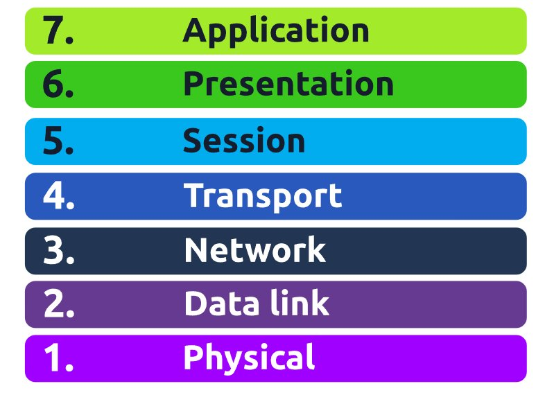

**Task 1**

The **OSI** model (or **O**pen **S**ystems **I**nterconnection Model) is an absolute fundamental model used in networking.  This critical model provides a framework dictating how all networked devices will send, receive and interpret data.


Answers:

What does the "OSI" in "OSI Model" stand for?
```
Open Systems Interconnection
```
How many layers (in digits) does the OSI model have?
```
7
```
What is the key term for when pieces of information get added to data?
```
encapsulation
```

**Task 2: LAYER 7 - APPLICATION**

The application layer of the OSI model is the layer that you will be most familiar with. This familiarity is because the application layer is the layer in which protocols and rules are in place to determine how the user should interact with data sent or received.

Everyday applications such as email clients, browsers, or file server browsing software such as FileZilla provide a friendly, **G**raphical **U**ser **I**nterface (**GUI**) for users to interact with data sent or received. Other protocols include **DNS** (**D**omain **N**ame **S**ystem), which is how website addresses are translated into IP addresses.

Answers:

What is the name of this Layer?
```
Application
```
What is the technical term that is given to the name of the software that users interact with?
```
Graphical User Interface
```

**Task 3: LAYER 6 - PRESENTATION**

Layer 6 of the OSI model is the layer in which standardisation starts to take place. Because software developers can develop any software such as an email client differently, the data still needs to be handled in the same way — no matter how the software works.

This layer acts as a translator for data to and from the application layer (layer 7). The receiving computer will also understand data sent to a computer in one format destined for in another format. For example, when you send an email, the other user may have another email client to you, but the contents of the email will still need to display the same.

Security features such as data encryption (like HTTPS when visiting a secure site) occur at this layer.

Answers:

What is the name of this Layer?
```
Presentation
```
What is the main purpose that this Layer acts as?
```
Translator
```

**Task 4: LAYER 5 - SESSION**

Once data has been correctly translated or formatted from the presentation layer (layer 6), the session layer (layer 5) will begin to create a connection to the other computer that the data is destined for. When a connection is established, a session is created. Whilst this connection is active, so is the session.

The session layer (layer 5) synchronises the two computers to ensure that they are on the same page before data is sent and received. Once these checks are in place, the session layer will begin to divide up the data sent into smaller chunks of data and begin to send these chunks (packets) one at a time. This dividing up is beneficial because if the connection is lost, only the chunks that weren't yet sent will have to be sent again — not the entire piece of the data (think of it as loading a save file in a video game).

What is worthy of noting is that sessions are unique — meaning that data cannot travel over different sessions, but in fact, only across each session instead.

Answers:

What is the name of this Layer?
```
Session
```
What is the technical term for when a connection is successfully established?
```
Session
```
What is the technical term for "small chunks of data"?
```
Packets
```

**Task 5: LAYER 4 - TRANSPORT**

Layer 4 of the OSI model plays a vital part in transmitting data across a network and can be a little bit difficult to grasp. When data is sent between devices, it follows one of two different protocols that are decided based upon several factors:

- TCP
- UDP

| **Advantages of TCP**                                                                    | **Disadvantages of TCP**                                                                                                                          |
| ---------------------------------------------------------------------------------------- | ------------------------------------------------------------------------------------------------------------------------------------------------- |
| Guarantees the accuracy of data.                                                         | Requires a reliable connection between the two devices. If one small chunk of data is not received, then the entire chunk of data cannot be used. |
| Capable of synchronising two devices to prevent each other from being flooded with data. | A slow connection can bottleneck another device as the connection will be reserved on the receiving computer the whole time.                      |
| Performs a lot more processes for reliability.                                           | TCP is significantly slower than UDP because more work has to be done by the devices using this protocol.\|                                       |

TCP is used for situations such as file sharing, internet browsing or sending an email. This usage is because these services require the data to be accurate and complete (no good having half a file!).

| **Advantages of UDP**                                                                                                 | **Disadvantages of UDP**                                                           |
| --------------------------------------------------------------------------------------------------------------------- | ---------------------------------------------------------------------------------- |
| UDP is much faster than TCP.                                                                                          | UDP doesn't care if the data is received.                                          |
| UDP leaves the application layer (user software) to decide if there is any control over how quickly packets are sent. | It is quite flexible to software developers in this sense.                         |
| UDP does not reserve a continuous connection on a device as TCP does.                                                 | This means that unstable connections result in a terrible experience for the user. |
UDP is useful in situations where there are small pieces of data being sent. For example, protocols used for discovering devices (_ARP_ and _DHCP_ ) or larger files such as video streaming (where it is okay if some part of the video is pixelated. 

Answers:

What is the name of this Layer?
```
Transport
```
What does TCP stand for?
```
Transmission Control Protocol
```
What does UDP stand for?
```
User Datagram Protocol
```
What protocol guarantees the accuracy of data?
```
TCP
```
What protocol doesn't care if data is received or not by the other device?
```
UDP
```
What protocol would an application such as an email client use?
```
TCP
```
What protocol would an application that downloads files use?
```
TCP
```
What protocol would an application that streams video use?
```
UDP
```

**Task 6: LAYER 3- NETWORK**

The third layer of the OSI model (network layer) is where the magic of routing & re-assembly of data takes place (from these small chunks to the larger chunk). Firstly, routing simply determines the most optimal path in which these chunks of data should be sent.

Whilst some protocols at this layer determine exactly what is the "optimal" path that data should take to reach a device, we should only know about their existence at this stage of the networking module. Briefly, these protocols include **OSPF** (**O**pen **S**hortest **P**ath **F**irst) and **RIP** (**R**outing **I**nformation **P**rotocol).

At this layer, everything is dealt with via IP addresses such as 192.168.1.100. Devices such as routers capable of delivering packets using IP addresses are known as Layer 3 devices — because they are capable of working at the third layer of the OSI model.

Answers:

What is the name of this Layer?
```
Network
```
Will packets take the most optimal route across a network? (Y/N)
```
Y
```
What does the acronym "OSPF" stand for?
```
Open Shortest Path First
```
What does the acronym "RIP" stand for?
```
Routing Information Protocol
```
What type of addresses are dealt with at this layer?
```
IP Addresses
```

**Task 7: LAYER 2- DATA LINK**

The data link layer focuses on the physical addressing of the transmission. It receives a packet from the network layer (including the IP address for the remote computer) and adds in the physical **MAC** (Media Access Control) address of the receiving endpoint. Inside every network-enabled computer is a **N**etwork **I**nterface Card (**NIC**) which comes with a unique MAC address to identify it.

MAC addresses are set by the manufacturer and literally burnt into the card; they can’t be changed – although they can be spoofed. When information is sent across a network, it’s actually the physical address that is used to identify where exactly to send the information.

Additionally, it’s also the job of the data link layer to present the data in a format suitable for transmission.

Answers:

What is the name of this Layer?
```
Data Link
```
What is the name of the piece of hardware that all networked devices come with?
```
Network Interface Card
```

**Task 8: LAYER 1- PHYSICAL**

This layer is one of the easiest layers to grasp. Put simply, this layer references the physical components of the hardware used in networking and is the lowest layer that you will find. Devices use electrical signals to transfer data between each other in a binary numbering system (1's and 0's).

Answers:

What is the name of this Layer?
```
Physical
```
What is the name of the numbering system that is both 0's and 1's?
```
Binary
```
What is the name of the cables that are used to connect devices?
```
Ethernet Cables
```

**Task 9: OSI GAME**


Answers:

Escape the dungeon to retrieve the flag. What is the flag?
```
THM{OSI_DUNGEON_ESCAPED}
```

I mean ... this whole room is pretty self explanatory, just know your layers and what it does