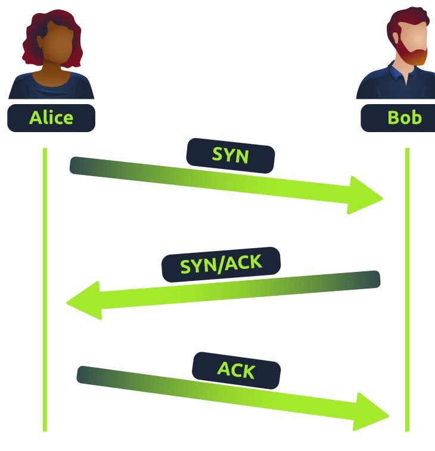
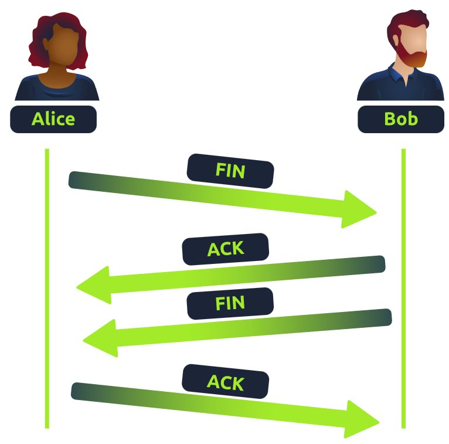
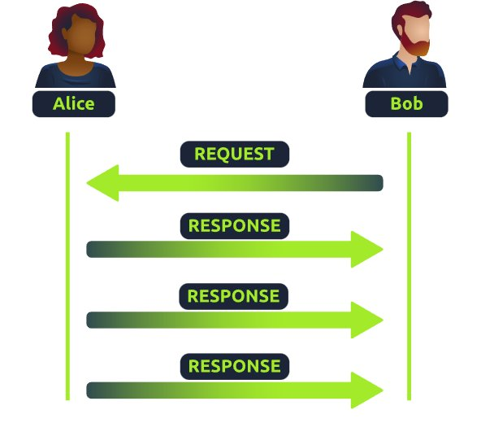
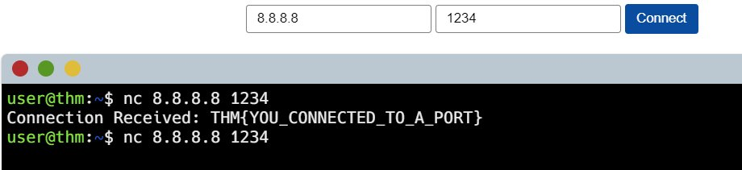

**Task 1**

Packets and frames are small pieces of data that, when formed together, makes a larger piece of information or message. However, they are two different things in the OSI model. A frame is at layer 2 - the data link layer, meaning there is no such information as IP addresses. Think of this as putting an envelope within an envelope and sending it away. The first envelope will be the packet that you mail, but once it is opened, the envelope within still exists and contains data (this is a frame).

| **Header**          | **Description**                                                                                                                                                         |
| ------------------- | ----------------------------------------------------------------------------------------------------------------------------------------------------------------------- |
| Time to Live        | This field sets an expiry timer for the packet to not clog up your network if it never manages to reach a host or escape!                                               |
| Checksum            | This field provides integrity checking for protocols such as TCP/IP. If any data is changed, this value will be different from what was expected and therefore corrupt. |
| Source Address      | The IP address of the device that the packet is being sent **from** so that data knows where to **return to**.                                                          |
| Destination Address | The device's IP address the packet is being sent to so that data knows where to travel next.                                                                            |

Answers:

What is the name for a piece of data when it **does have** IP addressing information?
```
Packet
```

What is the name for a piece of data when it **does not have** IP addressing information?
```
Frame
```

**Task 2**

**TCP** (or **T**ransmission **C**ontrol **P**rotocol for short) is another one of these rules used in networking.
The TCP/IP protocol consists of four layers and is arguably just a summarised version of the OSI model. These layers are:

- Application
- Transport
- Internet
- Network Interface

One defining feature of TCP is that it is **connection-based**, which means that TCP must establish a connection between both a client and a device acting as a server **before** data is sent.

| **Advantages of TCP**                                                                                       | **Disadvantages of TCP**                                                                                                                                              |
| ----------------------------------------------------------------------------------------------------------- | --------------------------------------------------------------------------------------------------------------------------------------------------------------------- |
| Guarantees the integrity of data.                                                                           | Requires a reliable connection between the two devices. If one small chunk of data is not received, then the entire chunk of data cannot be used and must be re-sent. |
| Capable of synchronising two devices to prevent each other from being flooded with data in the wrong order. | A slow connection can bottleneck another device as the connection will be reserved on the other device the whole time.                                                |
| Performs a lot more processes for reliability                                                               | TCP is significantly slower than UDP because more work (computing) has to be done by the devices using this protocol.                                                 |

Here are some important headers to note, better start memorising :)

| Header                 | Description                                                                                                                                                                                                                                         |
| ---------------------- | --------------------------------------------------------------------------------------------------------------------------------------------------------------------------------------------------------------------------------------------------- |
| Source Port            | This value is the port opened by the sender to send the TCP packet from. This value is chosen randomly (out of the ports from 0-65535 that aren't already in use at the time).                                                                      |
| Destination Port       | This value is the port number that an application or service is running on the remote host (the one receiving data); for example, a webserver running on port 80. Unlike the source port, this value is not chosen at random.                       |
| Source IP              | This is the IP address of the device that is sending the packet.                                                                                                                                                                                    |
| Destination IP         | This is the IP address of the device that the packet is destined for.                                                                                                                                                                               |
| Sequence Number        | When a connection occurs, the first piece of data transmitted is given a random number. We'll explain this more in-depth further on.                                                                                                                |
| Acknowledgement Number | After a piece of data has been given a sequence number, the number for the next piece of data will have the sequence number + 1. We'll also explain this more in-depth further on.                                                                  |
| Checksum               | This value is what gives TCP integrity. A mathematical calculation is made where the output is remembered. When the receiving device performs the mathematical calculation, the data must be corrupt if the output is different from what was sent. |
| Data                   | This header is where the data, i.e. bytes of a file that is being transmitted, is stored.                                                                                                                                                           |
| Flag                   | This header determines how the packet should be handled by either device during the handshake process. Specific flags will determine specific behaviours, which is what we'll come on to explain below.                                             |

And here are the important flags, gotta expand your brain abit more for this one...

| **Step** | **Message** | **Description**                                                                                                                                                                                                                                    |
| -------- | ----------- | -------------------------------------------------------------------------------------------------------------------------------------------------------------------------------------------------------------------------------------------------- |
| 1        | SYN         | A SYN message is the initial packet sent by a client during the handshake. This packet is used to initiate a connection and synchronise the two devices together (we'll explain this further later on).                                            |
| 2        | SYN/ACK     | This packet is sent by the receiving device (server) to acknowledge the synchronisation attempt from the client.                                                                                                                                   |
| 3        | ACK         | The acknowledgement packet can be used by either the client or server to acknowledge that a series of messages/packets have been successfully received.                                                                                            |
| 4        | DATA        | Once a connection has been established, data (such as bytes of a file) is sent via the "DATA" message.                                                                                                                                             |
| 5        | FIN         | This packet is used to _cleanly (properly)_ close the connection after it has been complete.                                                                                                                                                       |
| #        | RST         | This packet abruptly ends all communication. This is the last resort and indicates there was some problem during the process. For example, if the service or application is not working correctly, or the system has faults such as low resources. |

Here's how it looks like.



Here's how **closing a connection** it looks like.



Answers:

What is the header in a TCP packet that ensures the integrity of data?
```
checksum
```

Provide the order of a normal Three-way handshake (with each step separated by a comma)
```
SYN,SYN/ACK,ACK
```

**Task 3**

Just read through the notes before and figure it out, its not rocket science, just need to click the correct flags, but then again if you're lazy here's the flag:


```
THM{TCP_CHATTER}
```

**Task 4**

The **U**ser **D**atagram **P**rotocol (**UDP**) is another protocol that is used to communicate data between devices.
Unlike its brother TCP, UDP is a **stateless** protocol that doesn't require a constant connection between the two devices for data to be sent. For example, the Three-way handshake does not occur, nor is there any synchronisation between the two devices.

| **Advantages of UDP**                                                                                           | **Disadvantages of UDP**                                                           |
| --------------------------------------------------------------------------------------------------------------- | ---------------------------------------------------------------------------------- |
| UDP is much faster than TCP.                                                                                    | UDP doesn't care if the data is received or not.                                   |
| UDP leaves the application (user software) to decide if there is any control over how quickly packets are sent. | It is quite flexible to software developers in this sense.                         |
| UDP does not reserve a continuous connection on a device as TCP does.                                           | This means that unstable connections result in a terrible experience for the user. |
Here's the headers:

| **Header**          | **Description**                                                                                                                                                                                                                   |
| ------------------- | --------------------------------------------------------------------------------------------------------------------------------------------------------------------------------------------------------------------------------- |
| Time to Live (TTL)  | This field sets an expiry timer for the packet, so it doesn't clog up your network if it never manages to reach a host or escape!                                                                                                 |
| Source Address      | The IP address of the device that the packet is being sent from, so that data knows where to return to.                                                                                                                           |
| Destination Address | The device's IP address the packet is being sent to so that data knows where to travel next.                                                                                                                                      |
| Source Port         | This value is the port that is opened by the sender to send the UDP packet from. This value is randomly chosen (out of the ports from 0-65535 that aren't already in use at the time).                                            |
| Destination Port    | This value is the port number that an application or service is running on the remote host (the one receiving the data); for example, a webserver running on port 80. Unlike the source port, this value is not chosen at random. |
| Data                | This header is where data, i.e. bytes of a file that is being transmitted, is stored.                                                                                                                                             |

Here's quick diagram:



Answers:

What does the term "UDP" stand for?
```
User Datagram Protocol
```
What type of connection is "UDP"?
```
stateless
```
What protocol would you use to transfer a file?
```
TCP
```
What protocol would you use to have a video call?
```
UDP
```

**Task 5**

Networking devices also use ports to enforce strict rules when communicating with one another. When a connection has been established (recalling from the OSI model's room), any data sent or received by a device will be sent through these ports. In computing, ports are a numerical value between **0** and **65535** (65,535).

|                                                                    |                 |                                                                                                                                                            |
| ------------------------------------------------------------------ | --------------- | ---------------------------------------------------------------------------------------------------------------------------------------------------------- |
| **Protocol**                                                       | **Port Number** | **Description**                                                                                                                                            |
| **F**ile **T**ransfer **P**rotocol (**FTP**)                       | 21              | This protocol is used by a file-sharing application built on a client-server model, meaning you can download files from a central location.                |
| **S**ecure **Sh**ell (**SSH**)                                     | 22              | This protocol is used to securely login to systems via a text-based interface for management.                                                              |
| **H**yper**T**ext Transfer Protocol (**HTTP**)                     | 80              | This protocol powers the World Wide Web (WWW)! Your browser uses this to download text, images and videos of web pages.                                    |
| **H**yper**T**ext **T**ransfer **P**rotocol **S**ecure (**HTTPS**) | 443             | This protocol does the exact same as above; however, securely using encryption.                                                                            |
| **S**erver **M**essage **B**lock (**SMB**)                         | 445             | This protocol is similar to the File Transfer Protocol (FTP); however, as well as files, SMB allows you to share devices like printers.                    |
| **R**emote **D**esktop **P**rotocol (**RDP**)                      | 3389            | This protocol is a secure means of logging in to a system using a visual desktop interface (as opposed to the text-based limitations of the SSH protocol). |




Answers:

```
THM{YOU_CONNECTED_TO_A_PORT}
```

aand we are done with this lab wheee.